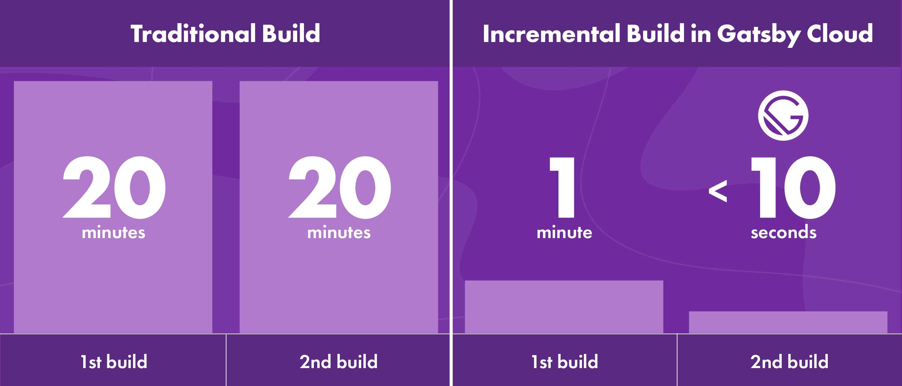

## Gatsby Cloud + Wordpress

Gatsby vient d'annoncer le lancement du [nouveau plugin source pour Wordpress](https://github.com/gatsbyjs/gatsby-source-wordpress-experimental) en version bêta.

Ce plugin a pour but d'amplifier vos éditeurs de contenu grâce à une publication presque instantanée. 
Ceci grâce aux constructions incrémentielles, et cela, uniquement disponible sur Gatsby Cloud.

N'hésitez pas à consulter la documentation sur l'utilisation de [Wordpress avec GatsbyJS](https://www.gatsbyjs.org/docs/glossary/headless-wordpress/)

## La problématique de base

Le problème qu'il y avait auparavant et qui frustré énormément les créateurs de contenu avec un générateur de site statique, c'est qu'au moindre changement de données, le temps reconstruction (obligatoire) de l'intégralité de leurs sites grandissaient.  
Alors qu'avec CMS de type Wordpress la publication se fait de manière instantanée pour tout nouvel ajout de contenu.  

Je vous laisse donc imaginer le temps énorme si un site comme le New York Times devait *rebuild* son site à chaque fois qu'un éditeur ajouter un article ! 
C'est pourquoi des CMS comme Wordpress ont souvent été préférés et que bon nombre de sites l'utilisent.

## Les nouvelles fonctionnalités  

Voici une image représentative d'un *build* traditionnel et celui du nouveau *build* dit incrémentale.

Le moteur de données de Gatsby qui est alimenté par GraphQL va suivre les dépendances entre les pages données et, lorsque une ou plusieurs données changent, il va planifier la quantité minimale de travail nécessaire pour actualiser le site et le mettre à jour.  

Bref, on peut dire que c'est une sacrée avancée !

Voici ce que le nouveau plugin apporte :

- Un aperçu du contenu au fur et à mesure que vous l'écrivez avec Gatsby Preview
- La publication de nouveau contenue presque instantanément 
- Liens et images dans le code HTML du contenu peuvent désormais être utilisés avec [gatsby-image](https://www.gatsbyjs.org/docs/gatsby-image/) et [gatsby-link](https://www.gatsbyjs.org/docs/gatsby-link/)
- Seules les images référencées dans le contenu publié sont traitées par Gatsby, donc si vous avez une grande bibliothèque cela ne ralentira pas vos temps de construction (et ça, c'est top)
- Toute extension WPGraphQL met automatiquement ses données à la disposition de votre projet Gatsby. Vous pouvez donc utiliser les plugins [SEO](https://github.com/ashhitch/wp-graphql-yoast-seo), modélisation de contenu, traduction, ecommerce.

## Démo

N'hésitez pas à regarder cette [vidéo](https://youtu.be/vyuEu95yQkA) proposé par GatsbyJS afin de voir cette nouvelle fonctionnalité à l'œuvre.